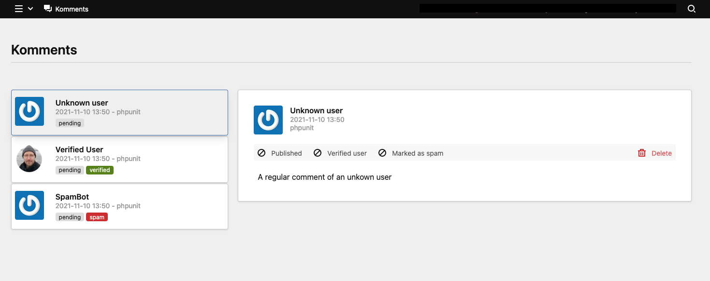
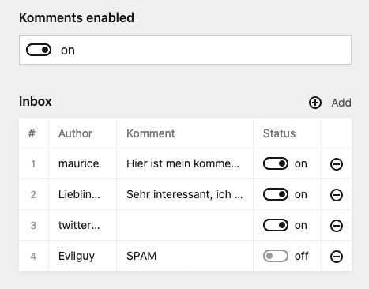
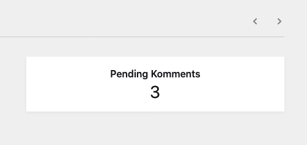

# Komments

  

A Kirby comment plugin

## Features

- ✅ Receive comments from a form on your site
  - The user will be informed that the komment is in moderation
  - Spam detection
  - Reject spam or just mark komments as spam
- ✅ Receive and send webmentions
- ✅ Send updates to Mastodon
- ✅ Ping archive.org
- ✅ Panel support
  - Dashboard for komments in moderation/spam
  - Moderate komments on your page
  - Disable/enable komments per page
- ✅ Disable komments after a certain number of dates in relation to the publish date
- ✅ Reply to comments
- ✅ Verified badge for logged in users

**As of version 0.10.0 the split view is the default view** The mixed view is deprecated due to the new nested comments functionality.


(The komment dashboard)

## Installation

### Install the plugin

- `composer require mauricerenck/komments`
- unzip [master.zip](https://github.com/mauricerenck/komments/releases/latest) as folder `site/plugins/komments`
- `git submodule add https://github.com/mauricerenck/komments.git site/plugins/komments`

---

### Adding Komments to your site

After Installing the Plugin add the snippet to your template. There are two snippets for you to use:

To list all komments and webmentions:

`<?php snippet('komments/webmention-splitted'); ?>`

To show the komment form

`<?php snippet('komments/kommentform'); ?>`

After adding the snippets, you may also want to add the stylesheet within the `<head></head>` of your site:

`<?php echo css(['/media/plugins/mauricerenck/komments/komments.css']); ?>`

---

### Adding Komments to your panel blueprint

if you use the panel, you may want to add the komments section to your blueprints like so:

```
sections:
    komments:
        extends: sections/komments
```

Add this to every blueprint you wish to enable komments on. This will allow you to enable/disable komments for each individual page and to see and edit the list of komments for that page.



---

### Show number of pending Komments in Panel

If you want to have the number of pending komments in view, you can add the `kommentsPending` panel field wherever you want. It's refreshing every minute, so you won't miss a new Komment. Just add the field to the blueprint:

```
fields:
  kommentsPending:
    type: kommentsPending
    label: Pending Komments
```

You could add it to your site.yml blueprint so you see the number of pending Komments right after logging in.



---

## Options

You can fine tune the komments to behave as you whish, use this options in `config.php` file.

| Option                            | Default                                     | Description                                                                                              |
| --------------------------------- | ------------------------------------------- | -------------------------------------------------------------------------------------------------------- |
| `debug`                           | `false`                                     | Enables debug mode and logs all webmentions to a file                                                    |
| `enable-webmention-support`       | `true`                                      | Listen to Webmentions and save them as komment                                                           |
| `webmention-auto-publish`         | `true`                                      | When you receive a webmention set status to published                                                    |
| `komment-auto-publish`            | `false`                                     | When you receive a komment set status to published                                                       |
| `send-mention-on-update`          | `true`                                      | Detect urls in your pages and send webmentions                                                           |
| `send-limit-to-templates`         | `[]`                                        | An array of template names (strings). When set webmentions will be sent only when this pages are updated |
| `send-mention-url-fields`         | `['text']`                                  | An array of fieldnames in which the plugin will search for urls                                          |
| `send-to-mastodon-on-publish`     | `false`                                     | Send a post to mastodon when publishing a page                                                           |
| `mastodon-bearer`                 | -                                           | Your Mastodon bearer Token                                                                               |
| `mastodon-instance-url`           | `'https://mastodon.social/api/v1/statuses‘` | Your Mastodon API Endpoint                                                                               |
| `mastodon-text-field`             | `'mastodonTeaser'`                          | The fieldname of the field you write your mastodon msg in, otherwise the title is used                   |
| `ping-archiveorg`                 | `false`                                     | Enable if you want to inform archive.org when you update a page                                          |
| `auto-delete-spam`                | `true`                                      | When comment spam is detected it will be rejected, set to false to just mark the comment as SPAM         |
| `auto-disable-komments`           | `0`                                         | Disables the komment form after `n` number of days. Use `0` to never disable komments (default)          |
| `auto-disable-komments-datefield` | `'date'`                                    | Set a field to function as publish date field used for `auto-disable-komments`                           |
| `komment-icon-like`               | '❤️'                                        | The icon for likes in your komment list                                                                  |
| `komment-icon-reply`              | '💬'                                        | The icon for replies/comments in your komment list                                                       |
| `komment-icon-repost`             | '♻️'                                        | The icon for reposts in your komment list                                                                |
| `komment-icon-mention`            | '♻️'                                        | The icon for mention in your komment list                                                                |
| `komment-icon-verified`           | '✅'                                        | The icon for the verify badge list                                                                       |
| `replyClassNames`                 | ''                                          | add classnames tto the reply link                                                                        |

**Please make sure to prefix all the options with `mauricerenck.komments.`**. For example the debug option should be set in your `config.php` like so: `'mauricerenck.komments.debug' => true`

## Page Methods

| Method                        | Returns   | Exsample                                                                                   |
| ----------------------------- | --------- | ------------------------------------------------------------------------------------------ |
| `$page->kommentCount()`       | `integer` | `<?php echo $page->kommentCount(); ?> comments`                                            |
| `$page->kommentsAreEnabled()` | `boolean` | `<?php if($page->kommentsAreEnabled()): ><button>Write a comment!</button><?php endif; ?>` |
| `$page->hasQueuedKomments()`  | `boolean` | `<?php if($page->hasQueuedKomments()): >There are comments in moderation<?php endif; ?>`   |

---

## Special features

Next to komments directly on your page, there are some other features enabled by this plugin

### Disable komment form after n days

You can let the plugin automatically disable komments after a certain number of days after the page was published. So you could set `auto-disable-komments` to `14`. When you publish a page the komments on that page will be disabled 14 days after the publish date. Only webmentions will be received after this. You can define any date field as a source by using the option `auto-disable-komments-datefield`. The default datefield is `date`.

Please be aware: If you configure a non-existing date field, this will result in a disabled komment state for all pages.

### Receiving webmentions

**To receive webmentions you have to install the [tratschtante plugin](https://github.com/mauricerenck/tratschtante) and configure it.** Tratschtante will handle all the webmentions and normalize their data. Currently only webmention.io is supported. After installing tratschtante, komment will automaticly be informed about new webmentions.

**Webmention support is enabled by default but won't work until you install tratschtante.**

### Sending Webmentions

You don't need tratschtante to send webmentions. By default the plugin will try to send webmentions to all urls it finds in your page. You might want to tell the plugin in which fields to look for urls, you can do that by providing a list of fieldnames in the `mauricerenck.komments.send-mention-url-fields` option. So if you have an intro and a text field in your blueprint, you might want to add those:

```
'mauricerenck.komments.send-mention-url-fields' => [
        'intro',
        'text',
    ]
```

If you just want to send webmention on specific pages, like only on blogposts, you can set a limit to those templates by using the `mauricerenck.komments.send-limit-to-templates` option. For example, using the starterkit, if you just want to send mentions on notes, do so:

```
'mauricerenck.komments.send-limit-to-templates' => [
        'note',
    ]
```

### Sending new pages to mastodon

If you want to, you can inform your mastodon followers of new pages/posts on your site. Just set the `mauricerenck.komments.send-to-mastodon-on-publish` to `true`. Komments will then try to publish a mastodon post everytime you publish a page. This can also be limited by template (see sending webmentions above)

In order to be able to publish to your mastodon account, you need to set a bearer token and your mastodon api endpoint. Please have a look at your mastodon instance on how to get that data.

### Changing the komment list on your site

By changing the the icon options you can add your own emoji or icons. You can set simple text or even full html-code.
If you want to change the styling, have a look at the classes, you can find the default styling in the `assets` folder of this plugin.

You can also modify the javascript part, but be aware, that this might result in false spam detection.
