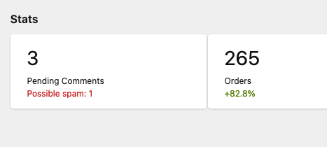

# Adding Komments to the panel


## Moderation view

By default Komments comes with a panel view for moderation. You don't need to do anything for this. In the panel menu you should see an entry called "Komments".


## Adding Komments to your panel blueprint

if you use the panel, you may want to add the komments section to your blueprints like so:

```
sections:
    komments:
        extends: sections/komments
```

Add this to every blueprint you wish to enable komments on. This will allow you to enable/disable komments for each individual page and to see and edit the list of komments for that page.


## Show number of pending Komments in Kirby Panel Stats

Kirby 3.7 introduced the Panel Stats sections which allow you to build a little dashboard and show keymetrics. You can use this to show pending comments:

```
sections:
  stats:
    type: stats
    reports:
      - label: Pending Comments
        value: "{{ site.numberOfPendingComments }}"
        info: "Possible spam: {{ site.numberOfSpamComments }}"
        link: https://getkirby.com/shop
        theme: negative
```



To get the number of pending comments use the site method `numberOfPendingComments`. To get pending comments marked as spam use `numberOfSpamComments`

To learn more about Kirby stats, please have a look here: https://getkirby.com/docs/reference/panel/sections/stats

## DEPRECATED! Show number of pending Komments in Panel

The field `kommentsPending` is deprecated, please use the Panel Stats section instead.
