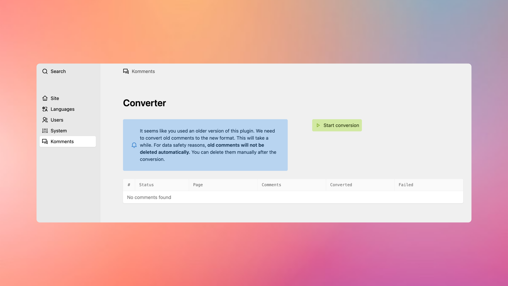
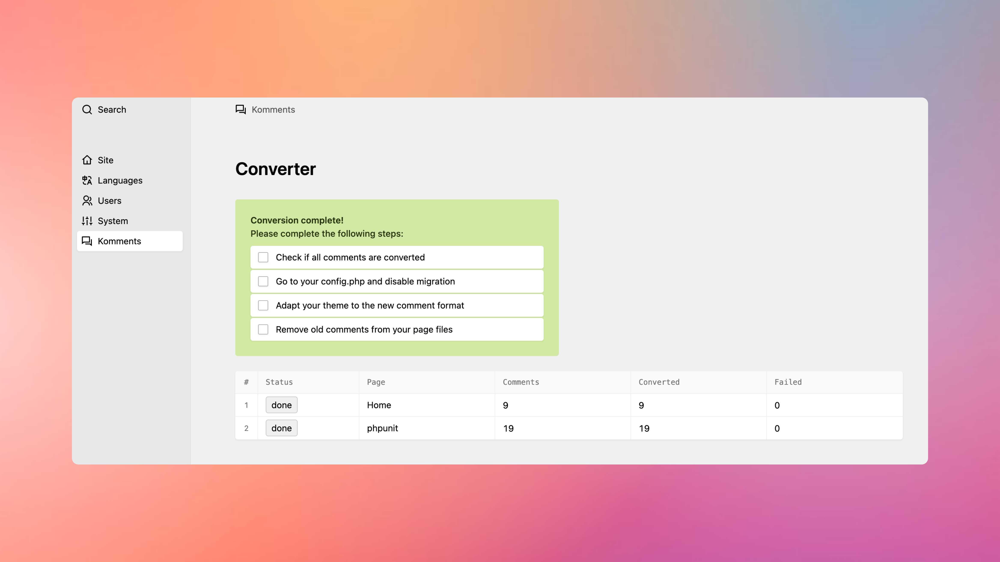

# Upgrade Guide

## Version 2 to 3

In case you are upgrading from version 2 to version 3, please read carefully:

**Updating to version 3 introduces several breaking changes!**

Komments 3 comes with a new data structure for storing comments. Because of this, old comments have to be migrated. The plugin will not delete old comments, to decrease the risk of data loss. But depending on the storage type you chose it has to write to your page files.

Please:

1. Backup your existing data
2. Run the migration on a local or test machine before doing this on your live site

Version 3 comes with major changes in all aspects of the plugin, you'll have to adapt your templates and code to the new version.

## Storage types

The plugin now is way more flexible in terms of storage types. You can choose between different storage options, such as:

-   File storage
-   Database storage

**File storage** will store all comments to your page files as the plugin did before. This works well for sites with a small number of comments. This storage type does not support all new features, like batch processing. I recommend switching to the database storage type.

**Database storage** will store all comments in a sqlite database. This is faster and more reliable than file storage. It also supports all new features, like batch processing. If you can, I recommend this storage type.

Sqlite is the new default storage type.

## Migration

You have to migrate old comments to the new data structure. There are two ways to do this:

1. Use the panel view to migrate the comments (recommended)
2. Use the migration Class to migrate comments programmatically

Both options are easy to use. Old comments will not be deleted, you have to clean up after migration. This is important to avoid data loss.

### Configure the storage type

Set the storage type in your `config.php`. In case of sqlite, you have to specify the path in which the database is stored. Choose a path where the database file can be written and which may be included in your backup. The content folder might be good place.

```php
'mauricerenck.komments.storage.type' => 'sqlite',
'mauricerenck.komments.storage.sqlitePath' => '../content/.db/',
```

If you want to use the file storage type, you need to set the following configuration:

```php
'mauricerenck.komments.storage.type' => 'markdown',
```

### Run the migration

When sqlite is set as a storage type, the plugin will run the database migration when it is initialized the next time. A database file should be created in the specified path.

#### Migration in the panel (recommended)

To migrate old comments to the new structure you can log in to the panel and open the Komments view in the left sidebar. It will show the migration screen until you disable migration mode.



Simply hit the button to start the migration. The plugin will scan all pages for comments, list each page and then starts to migrate each comment. Please do not close the page until the migration is finished.



#### Migration via Migration Class

If you want to run the migration programmatically, you can use the `KommentsMigration` class. Here is an example:

```php
<?php
$migration = new mauricerenck\Komments\Migrations();
$migration->convertComments();
?>
```

This will basically to the same as the panel migration but in one step.

**I recommend running the migration via the panel, as you lower the risk of running into timeouts, especially if you have a large number of comments.**

After the migration you can delete the old comments from your page files. You don't need to do this, if you don't want to.
When finished, open the `config.php` file and set `mauricerenck.komments.migrations.comments` to `false`. The next time you open the Komments view in the panel, you'll see the regular view with pending comments.

## Adapting your templates and snippets

One of the biggest changes is the access to the comments. There are no more arrays of comments and data. Instead everything is a structure as you know it from Kirby. This way accessing and filtering comments is much easier. But it also means that you need to adapt your templates and snippets to the new structure.
